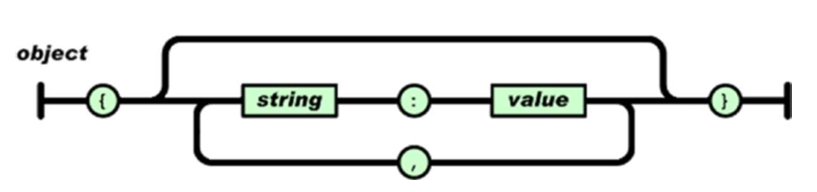

## Data collection:

* We will be studing about three three types of data:
&nbsp;&nbsp; 1. CSV
&nbsp;&nbsp; 2. json
&nbsp;&nbsp; 3. XML
&nbsp;&nbsp; 4. HTML
&nbsp;&nbsp; 5. SQL

### CSV

* In this file format the data is seperated with help of commas(,)
* It will take the first columns as headers and the text need not to be enclosed inside the single or double quotes.
* Each row indicates the list of instances of the file and if any attribute is absent then it will be filled with NAN values

```
sno,fruit,color,price
1,Apple,red,110.85
2,Banana,yellow,50.12
3,Mango,Yellow,70.29
4,Orange,organe,80.00
5,kiwi,green,150.00
6,pineapple,yellow,90.00
7,guava,green,20.00
```

#### Reading Data:

<strong>Method-1</strong>
```
csv_reader = csv.reader(open(file_name, 'rb'), delimiter=',')

Here csv.reader is imported from the module CSV.
rb - indicates read the binary files
delimiter - seperator

* The output of this file will in a generator object.
* To extract the out put from the generator we will be using a dictonary to append the data to the particular columns

# Method 1

from collections import defaultdict
import csv

csv_rows = []
csv_attr_dict = defaultdict(list)  # Initialize defaultdict with list factory
csv_reader = None

## Read the data from the CSV
with open('/workspaces/Machine_learning_2/unit1/fruits.csv', 'r') as file:
    csv_reader = csv.reader(file, delimiter=',')

    ## Iterate and extract data
    for row in csv_reader:
        print(row)
        csv_rows.append(row)

## Iterate and add attributes to the list
for row in csv_rows[1:]:
    csv_attr_dict['sno'].append(row[0])
    csv_attr_dict['fruit'].append(row[1])
    csv_attr_dict['color'].append(row[2])
    csv_attr_dict['price'].append(row[3])

csv_attr_dict

```

### json

* json stands for Java Script Notation(JSON).
* It is one of the most widely used data interchanged formats and used a lightweight alternative to fomats like XML.
* It is a human readable format and readable that is easy/simple to parse.
* It is in dictonary format in nested key value pairs.
* These 



### XML

* XML stands for <em>eXtensible Markup Language</em>
* It is a markup langauage which defines the rules for ecoding and sharing of the data accross the internet.
* It is a human readable similar to JSON
* XML langauge has syntactical rules and schemas defined and refined.
* It contains 4 major components
&nbsp;&nbsp; * Tag : A markup construct denoted by string enclosed with in angle brackets
&nbsp;&nbsp; * Content : Any data out side the tag is known as content
&nbsp;&nbsp; * Element : A logical construct of an XML with open and closing tag with or without attributes or many be simply an empty tag.
&nbsp;&nbsp; * Attribute : Key value pairs that represent the properties and meta data of the tag
* XML file is a tree structured and have branches off into various elements and have content begin at leaf node.
* XML parser use tree like structure to read XML content
* Their are two major types of XML parsers:

&nbsp;&nbsp; * <strong>DOM parser</strong>: The Document Object parser is the closest form of the representation of an XML. It parses the XML and generates the tree structure.These parsers are instable with hige XML files.

&nbsp;&nbsp; * <strong>SAX parser</strong>: The simple API for XML is variant widely used to used in web based paerser that parses an XML element by element and provides hooks to trigger event based on tags. It handles memeory issues but lacks overall representation power.


## Data description:

&nbsp;&nbsp; 1. Text
&nbsp;&nbsp; 2. Numeric
&nbsp;&nbsp; 3. Categorical

### Numeric:

* Numeric or number is an easiest form of representation and understood by most of the algorithms.
* These numeric values are usually scalar and can also be form the basis of vectors.
* This data is widely used in techniques like <em>Binning</em>,<em>Normalization</em>,<em>Quantization</em>

#### Text
* This type of data usually comprises of unstructured content such as textual and alphanumeric data.
* This type of 

